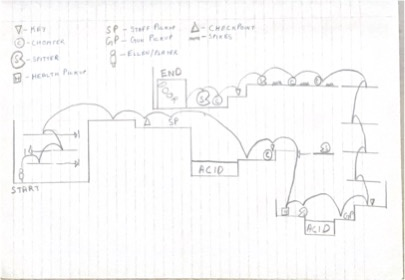
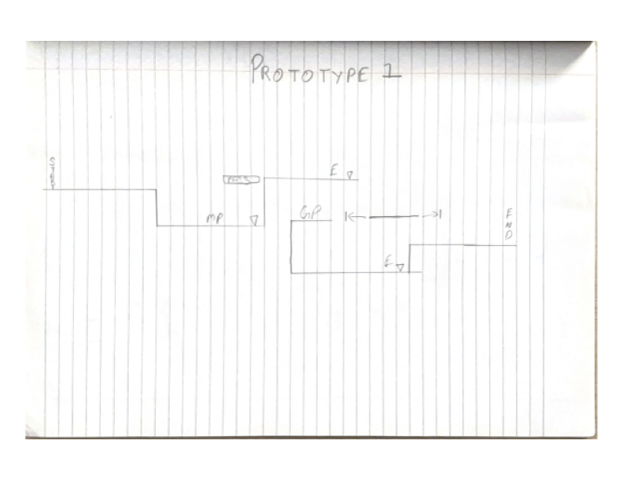

# COMP2150  - Level Design Document
### Name: [Parth Bhatia]
### Student number: [47876182] 

## 1. Player Experience (~700 words)
The level is structured to gradually increase in difficulty, guiding the player through escalating challenges. Initially, players reach a checkpoint and obtain a staff, enabling them to defend against enemy attacks. The level features various enemies, including chompers, which are close-range foes causing one health damage but are relatively easy to counter. Spitters, on the other hand, pose a greater challenge with their ranged attacks that also deduct one health point but are trickier to counter due to their attack method.

A significant test of skill comes early in the level with a challenging section where the player must navigate over acid at the bottom of a hill. Timing is crucial; a premature jump results in death and a respawn at the last checkpoint. This obstacle is the first of many hurdles the player must overcome to progress through the level, setting the tone for the type of careful strategy and timing required to navigate the remaining challenges successfully and reach the end of the level. This design ensures a balance of learning and challenge, pushing the player to adapt and strategize to advance.

### 1.1. Discovery
The level design skillfully introduces players to game controls and environmental strategies, emphasizing the use of terrain and platforms for defense against enemies. Players are equipped with melee and ranged weapons to tackle various threats and can replenish health through pickups. The difficulty of the level escalates progressively, starting with simpler challenges to help players acclimate and gradually introducing more complex scenarios. This approach ensures players develop their skills naturally, preparing them for the increasing challenges ahead and fostering a sense of accomplishment as they advance through the game.
### 1.2. Drama
The level strategically ramps up in intensity, starting off easy to allow players to familiarize themselves with the controls in a safe environment. The introduction of the staff near a checkpoint marks the beginning of increased challenges, pushing players to apply what they've learned. As the level progresses, the difficulty spikes, especially towards the end where players must utilize all acquired skills and the newly obtained gun to overcome a denser array of enemies. This peak in challenge tests the player's ability to integrate and apply their skills comprehensively. Successfully navigating this final onslaught brings a significant sense of achievement and relief. The level's design, with its gradual difficulty increase, ensures it remains accessible yet engaging, offering a satisfying balance of challenge and accomplishment.
### 1.3. Challenge
The main objectives within the level are to defeat the enemies and secure the key required to complete it. The level's difficulty is carefully modulated through the quantity and positioning of enemies, crafting a challenging environment for the player. For instance, guarding Key 2 is a floating spitter, presenting a significant challenge as the player lacks a firearm for an immediate takedown. This necessitates evasive maneuvers to avoid the spitter's attacks, secure a gun, and then eliminate the threat. Additionally, the positioning of acid around Key 1 poses another hurdle; placed within a pit, players must time their jumps with precision to avoid falling into the acid, risking a restart from the last checkpoint. These elements are designed to encourage strategic thinking, requiring players to navigate obstacles thoughtfully and make informed decisions to progress. This approach ensures the level remains sufficiently challenging, engaging the player in a continuous loop of assessment, decision-making, and action to achieve victory.
### 1.4. Exploration
The level is designed to offer limited exploration, focusing instead on strategizing the most effective way to defeat enemies. Much of the level is autonomous, with minimal exploration, yet it introduces various aspects into the game. The pass-through platform facilitates player progression upwards, simultaneously preventing backtracking to ensure players remain in the specific section of the level they've reached. There are numerous spots on the map designed as brief respite areas, allowing players a few moments to rest and recover from recent battles. This setup emphasizes forward momentum and strategic planning, ensuring that while the opportunity for exploration is restrained, the engagement with game mechanics and enemy encounters is deeply immersive.

## 2. Core Gameplay (~400 words)

The storyboard presents a meticulously crafted level that marries gameplay mechanics with narrative progression, encapsulating a journey of skill acquisition and strategic mastery. Beginning with the player's ascent through moving platforms, the level introduces basic mechanics and sets the stage for the challenges ahead. A significant checkpoint rewards the player with a staff, unlocking melee abilities and heralding the introduction of more complex obstacles, such as a key guarded by a chomper behind an acid hazard. This segment teaches caution and strategy.
The introduction of spitters escalates the difficulty, requiring the player to adapt their approach and utilize a newly provided gun, emphasizing the importance of tactical flexibility. The level's climax occurs as the player navigates through Passthrough Platforms to face a formidable grouping of chompers and spitters, testing all previously acquired skills in a demanding showdown.
Securing the final key from this encounter represents not just the level's completion, but the culmination of the player's growth and adaptability. The concluding cleanup phase allows for reflection on the journey and preparation for future challenges. This level design effectively combines environmental puzzles and enemy encounters to teach, test, and reward the player, ensuring a cohesive and engaging experience. Each challenge is designed to build upon the previous, encouraging skill development and strategic planning, making the level not merely a series of tasks but a narrative of personal achievement and mastery.

### 2.1. Acid
Found twice in the level to increase difficulty.
### 2.2. Checkpoints
1 checkpoint available before the first acid pit in case of player falling into the acid having to start over from there.
### 2.3. Chompers
Multiple chompers spread about the game to challenge the player.
### 2.4. Health Pickups
Health Pickup after the first key for the player to restore some health
### 2.5. Keys
3 keys placed strategically around the level behind enemies to be defeated first.
### 2.6. Moving Platforms
Moving platforms at the start to get the player up and then a spitter placed to make it more difficult for the player.
### 2.7. Passthrough Platforms
Set after the second level to allow the player to climb up to level 3.
### 2.8. Spikes
Scattered around the level with the other enemies.
### 2.9. Spitters
strategically placed around the map with other enemies to make it difficult for the player.
### 2.10. Weapon Pickup (Gun)
Placed in the second fight of the level.
### 2.11. Weapon Pickup (Staff)
Placed near the spawn for the player to get melee.

## 3. Spatiotemporal Design
### 3.1. Molecule Diagram

### 3.2. Level Map – Section 1

### 3.3.	Level Map – Section 2

### 3.4.	Level Map – Section 3

## 4. Iterative Design (~400 words)
Starting with low-fidelity paper sketches, I employed an iterative design process to draft the game level's initial layout. This approach allowed for rapid prototyping and straightforward adjustments, streamlining the exploration of ideas and early identification of any issues without delving into digital complexities. After perfecting the low-fidelity design, I transitioned the concept into Unity for further refinement and development. This stage involved testing, evaluation, and polishing, ensuring the level was both engaging and enjoyable, thus encouraging players to continue through the game and look forward to possible sequels. The shift from low-fidelity sketches to detailed Unity implementations underscored the effectiveness of iterative design in creating compelling game levels.

In the initial stages of my iterative design, the level layout was envisioned as a single, linear path from start to finish. However, this concept evolved into a two-story design, where players ascend through passthrough platforms. Originally, the path dipped shortly after the beginning and then rose again; this was reimagined to have players ascend to obtain the melee weapon before descending. Iterating through various designs was crucial for finalizing the level layout and deciding on the placement of elements. For instance, my initial design did not include acid obstacles, but through prototyping and identifying gameplay flaws, I introduced two acid pools in challenging locations to diversify the path. This process of iteration and prototyping was invaluable, not only in enhancing the level’s complexity but also in refining the placement of key items. In earlier designs, a key was placed in an optional spot, potentially complicating the completion of the level. Addressing these flaws led to a more engaging and navigable level design, demonstrating the effectiveness of iterative design in pinpointing and correcting weaknesses in the game's structure.   

